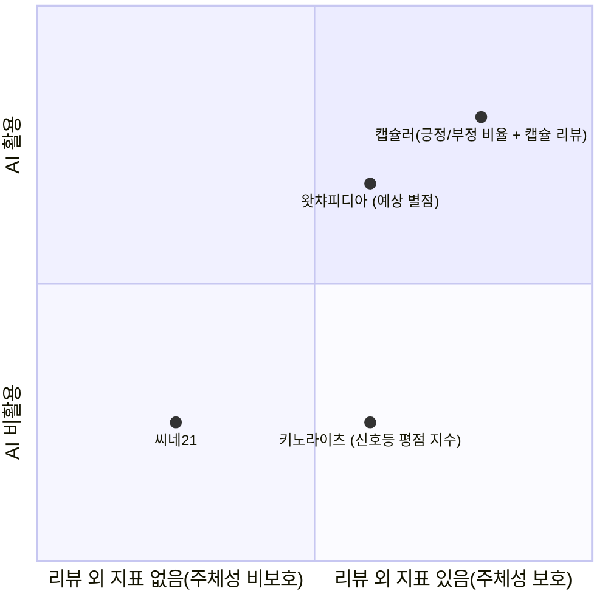
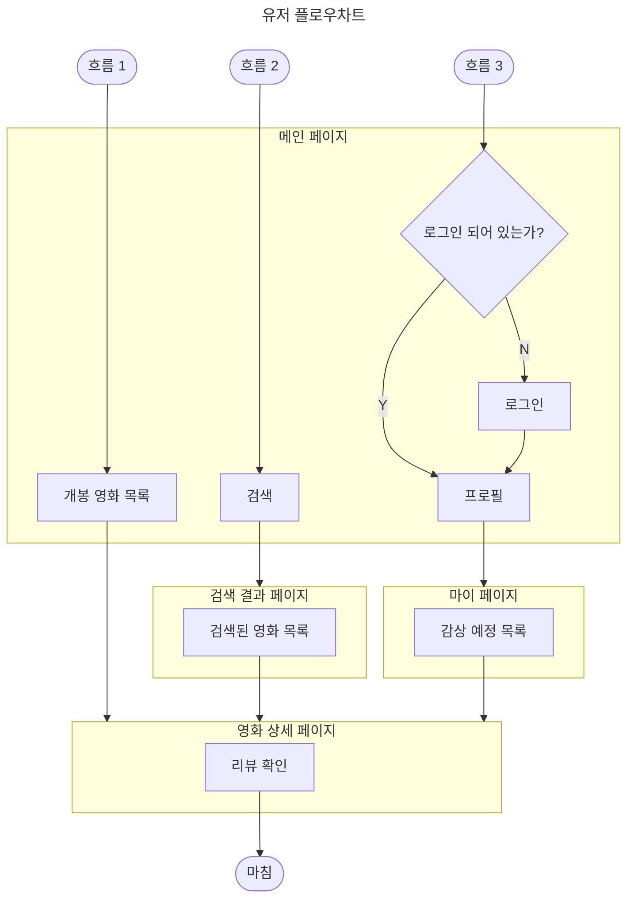
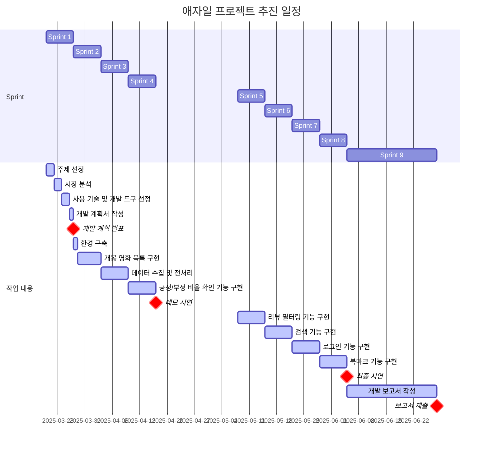
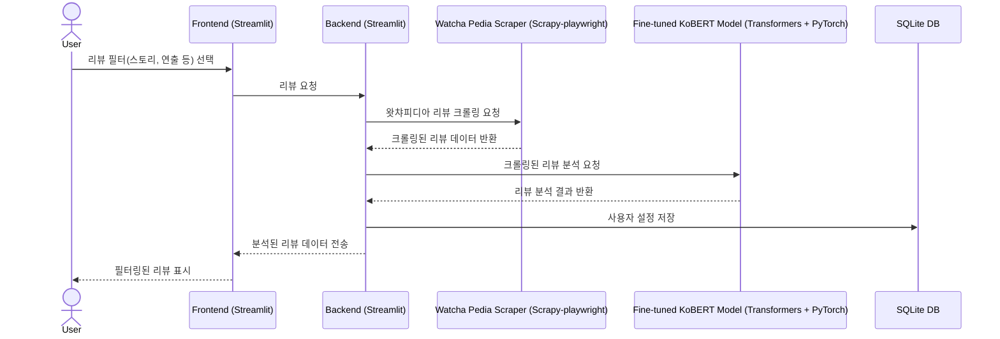

## 소개
### 캐치프레이즈
- *`__=this.catchphrase`*

### 주제
- *`__=this.topic`*

### 주요 기능
- 최신 영화 리스트 제공
- 영화별 긍정/부정 비율 확인 가능
- 스포일러 필터링을 영화의 각 평가 지표에 대해 개별적으로 적용 가능

## 배경 및 필요성
### 배경
- 영화란 종합 예술​
- 다양한 요소로 구성되며, 여러 측면에서 평가될 수 있음

#### 1. 기술적 측면:
- **촬영(시네마토그래피)**: 카메라 워크, 조명, 색감, 구도
- **편집**: 장면 전환, 컷 구성, 리듬감
- **음향**: 사운드 디자인, 배경음악(BGM), 효과음
- **특수효과(VFX)**: CGI, 실감 나는 액션·판타지 연출
- **프로덕션 디자인**: 세트, 소품, 의상
    
#### 2. 시나리오(스토리 및 각본):
- **줄거리(구성력)**: 전개 방식, 기승전결
- **대사**: 대사의 자연스러움, 감정 전달력
- **캐릭터 구축**: 개성과 심리적 깊이
- **주제의식**: 영화가 전달하는 메시지
    
####  3. 연기 및 캐릭터 표현
- **배우의 연기력**: 감정 표현, 대사 전달
- **배우 간 케미스트리**: 연기 호흡, 시너지
- **배역과의 적합성**: 캐스팅의 적절성

#### 4. 연출(감독의 역량)
- **장르 해석**: 장르적 특징을 얼마나 잘 살렸는가
- **미장센**: 화면 속 요소 배치, 분위기 조성
- **감독의 스타일**: 영화만의 독창성, 차별점
    
#### 5. 감상 및 몰입도
- **재미(오락성)**: 흥미로운가? 지루하지 않은가?
- **감정 전달**: 감동, 긴장감, 공포 등 정서적 반응
- **메시지 전달력**: 의미 있는 메시지를 효과적으로 전달했는가

#### 6. 기타 요소
- **OST**: 음악의 활용과 감정적 효과
- **흥행성(대중성 vs 예술성)**: 상업성과 작품성의 균형
- **사회적 영향력**: 시대적 반영, 문화적 의미

- 이렇게 다양한 요소가 있지만 대부분의 서비스에서 스포일러 필터링을 오직 시나리오, 그 중에서도 줄거리가 포함된 리뷰에만 편향적으로 적용하고 있음

### 필요성
- 주체적인 영화 감상을 위해서는 모든 측면의 스포일러를 방지해야 함

### 해결 방안
> [!TIP] 주요 기능이 새로운 시선으로 보이는 지점

- 리뷰를 캡슐화함
- 기본적으로 모든 리뷰 내용을 감추고 긍정/부정의 비율만 보여줌
- 서비스 이용자가 선택한 측면에 해당하는 스포일러만 허용

## 개발 목표
- KoBERT 기반 다중 레이블 분류 모델을 통해, 선택적 스포일러 필터링이 가능하며 영화별 긍정/부정 평가 비율까지 제공하는 웹 서비스 구축

## 기대 효과
- 사전 정보를 차단하여 주체적인 영화 감상 가능

## 시장 분석
### 목표 사용자
- 주체적인 영화 감상을 원하는 일반인 및 마니아

### 사용자 시나리오
|항목|내용|
|---|---|
|사용자|이민재(27세)는 영화의 연출, 음악, 연기 등을 직접 경험하고 평가하는 것을 즐기는 영화 마니아이다.|
|시놉시스|민재는 최근 개봉한 한 영화를 보기 전, 스토리가 궁금해서 리뷰를 찾아본다. 하지만 기존 리뷰 사이트에서는 줄거리에 대한 스포일러 방지는 제공하면서도, 연출·음악·연기에 대한 정보는 아무런 제한 없이 노출하고 있다. 결국 리뷰를 보려다가 영화의 연출 방식과 특정 장면의 독창성까지 미리 알게 되어, 감상 경험을 저하시키는 불합리함을 느낀다. 기존 리뷰 사이트들이 스토리에만 초점을 맞추고 다른 요소들을 고려하지 않는 것이 불공정하다고 생각한 그는, 이런 문제를 해결할 방법을 찾다가 캡슐러를 발견한다. 캡슐러는 모든 리뷰를 기본적으로 감추고, 사용자가 원하는 요소만 선택해서 볼 수 있도록 설계되어 있어 흥미를 느끼고 사용해 보기로 한다.|
|니즈|영화의 연출, 음악, 연기 등을 스스로 평가하고 싶지만, 참고할 만한 리뷰를 보려 하면 원치 않는 정보까지 노출된다. 스토리 스포일러만 방지하는 기존 시스템은 불완전하며, 연출과 음악 등에 대한 정보도 차단할 수 있어야 한다. 영화 리뷰를 볼 때 내가 원하는 측면(예: 연출, 음악)만 선택적으로 확인할 수 있는 기능이 필요하다. |
|불편 사항| - 기존 리뷰 사이트는 줄거리 스포일러 방지만 제공하고, 연출·음악·연기 등의 정보는 무제한으로 노출되어 있음  - 리뷰를 확인하면 특정 장면의 연출 방식, 음악적 연출 등이 설명되어 있어 기대감이 사라짐  - 스토리만 보호하고 다른 요소는 그대로 공개하는 리뷰 시스템이 부조리하게 느껴짐 |
|대안 마련| - 기본적으로 모든 리뷰를 감추고, 긍정/부정 비율만 먼저 제공  - 사용자가 특정 요소(예: 연출과 음악)만 선택해서 리뷰를 볼 수 있도록 설정|
|서비스 구성| - 비율 기반 평가 제공: 긍정/부정 비율을 먼저 제공하여 전체적인 평가 분위기 파악 가능  - 캡슐 리뷰 시스템: 리뷰를 스토리, 연출, 음악, 연기 등으로 분리하여 사용자가 원하는 정보만 확인 가능|
|감성 요소|- '스포일러 없는 주체적인 영화 감상'을 강조하는 브랜딩  - 기존 리뷰 시스템의 불합리함을 해결한 진정한 의미의 스포일러 방지 기능을 제공함으로써 사용자 만족도 향상|

### 유사 서비스와의 차별성 (포지셔닝)

## 정보 구조 설계
### 메뉴 트리

### 정보 구조도

## 플로우차트

## 화면 구성도
## 와이어프레임
## 프로토타입

## 프로젝트 추진 일정

## 작업 세부 사항
| 스프린트 | 작업 내용 | 세부 사항 |
|---|---|---|
| Sprint 1 | 주제 선정 | 프로젝트 목표 및 주요 기능 정의 |
| | 시장 분석 | 경쟁 서비스 분석 (왓챠, IMDb 등) |
| | 사용 기술 및 개발 도구 선정 | Streamlit, Scrapy-Playwright, SQLite, KoBERT 등 도입 결정 |
| | 개발 계획서 작성 | 프로젝트 개요, 시스템 아키텍처, 일정 계획 문서화 |
| | 개발 계획 발표 | 주요 목표 및 기술 스택 발표 |
| Sprint 2 | 환경 구축 | Python 환경 설정, 라이브러리 설치 및 기본 폴더 구조 설계 |
| | 개봉 영화 목록 구현 | 왓챠피디아에서 개봉 영화 리스트 크롤링 |
| Sprint 3 | 데이터 수집 및 전처리 | Scrapy-Playwright로 리뷰 크롤링 및 저장 |
| | | 리뷰 정제(특수문자 제거, 불필요한 데이터 필터링) |
| | | 각 측면(스토리, 연기, 연출, 음악)에 대한 0/1 라벨링 추가|
| Sprint 4 | 긍정/부정 비율 확인 기능 구현 | KoBERT 모델을 활용한 감성 분석 |
| | | BCEWithLogitsLoss를 활용한 다중 레이블 예측 학습 |
| | | 시그모이드 활성화를 사용하여 0.5 기준으로 긍정/부정 분류 |
| | | SQLite를 활용해 긍/부정 비율 저장 및 조회 |
| Sprint 5 | 리뷰 필터링 기능 구현 | 사용자가 선택한 측면(스토리, 연출 등)에 따라 리뷰 숨김 처리 |
| | | KoBERT 모델의 예측 결과를 반영한 필터링 기능 추가 |
| Sprint 6 | 검색 기능 구현 | 영화 제목, 배우, 감독 등으로 리뷰 검색 가능하도록 구현 |
| | | 검색어와 리뷰 내용을 비교하는 간단한 NLP 적용 가능 |
| Sprint 7 | 로그인 기능 구현 | 로그인 페이지 UI 구현 (Streamlit) |
| | | SQLite를 활용한 사용자 인증 시스템 구축|
| Sprint 8 | 북마크 기능 구현 | 사용자가 관심 있는 영화 리뷰를 저장할 수 있도록 기능 추가 |
| | | 북마크한 리뷰를 확인하는 UI 및 DB 연동 |
| Sprint 9 | 개발 보고서 작성 | 프로젝트 진행 과정, 모델 학습 결과 및 성능 평가 문서화 |
| | 보고서 제출 | 최종 결과물 정리 및 문서 제출 |

## 개발 상세 내용
### 아키텍처 구조

### 디렉토리 구조

### 사용 기술 및 개발 도구
#### 사용 기술
#### 사용 언어
| 언어     | 버전     |
| ------ | ------ |
| Python | 3.13.2 |

#### 사용 서버
| 서버        | 버전     |
| --------- | ------ |
| Streamlit | 1.43.2 |

#### 사용 AI 모델
| 모델     | 버전    |
| ------ | ----- |
| KoBERT | 0.2.3 |

#### 사용 말뭉치 데이터
| 모델                           | 버전  | 출처                          |
| ---------------------------- | --- | --------------------------- |
| Naver sentiment movie corpus | 1.0 | https://github.com/e9t/nsmc |

#### 사용 라이브러리
| 언어     | 라이브러리             | 버전     | 컴포넌트/모듈|클래스                            | 용도                  |
| ------ | ----------------- | ------ | -----------------------------|-------- | ------------------- |
|  Python      | Streamlit         | 1.43.2 |                                       ||    서버 +  데이터 시각화          |
|         | Scrapy-playwright | 0.0.43 |  scrapy                      || 정적 데이터 크롤링 |
|            |      |                 |scrapy_playwright.page        |PageMethod| 왓챠피디아 리뷰 동적 데이터 크롤링 |
|        | Pandas            | 2.2.3  | pandas                                || 데이터 불러오기            |
|        | Scikit-learn      | 1.6.1  | sklearn.model_selection |train_test_split|      |
|        | Transformers        | 4.50.0|                                       ||                     |
|        |||                                       |BertModel|                     |
|        | PyTorch        | 2.6.0 |    torch                                   ||      NumPy와 같은 Tensor 라이브러리, 강력한 GPU 지원               |
|        |       | |    torch.optim                          ||    최적화(optimizer) 알고리즘을 포함하는 모듈                 |
|        |       | |torch.nn  ||           최대의 유연성을 위해 설계된 자동 그래디언트와 긴밀하게 통합된 신경망 라이브러리          |
|        |       | |    torch.utils.data                                   |Dataset|         편의성을 위한 DataLoader 및 기타 유틸리티 기능            |
|        |       | |    torch.utils.data                                   |DataLoader|         편의성을 위한 DataLoader 및 기타 유틸리티 기능            |

#### 사용 외부 리소스/API
| 외부 리소스    | URI                      | API |
| --------- | ------------------------ | --- |
| 왓챠피디아 코멘트 | https://pedia.watcha.com | 크롤링 |

