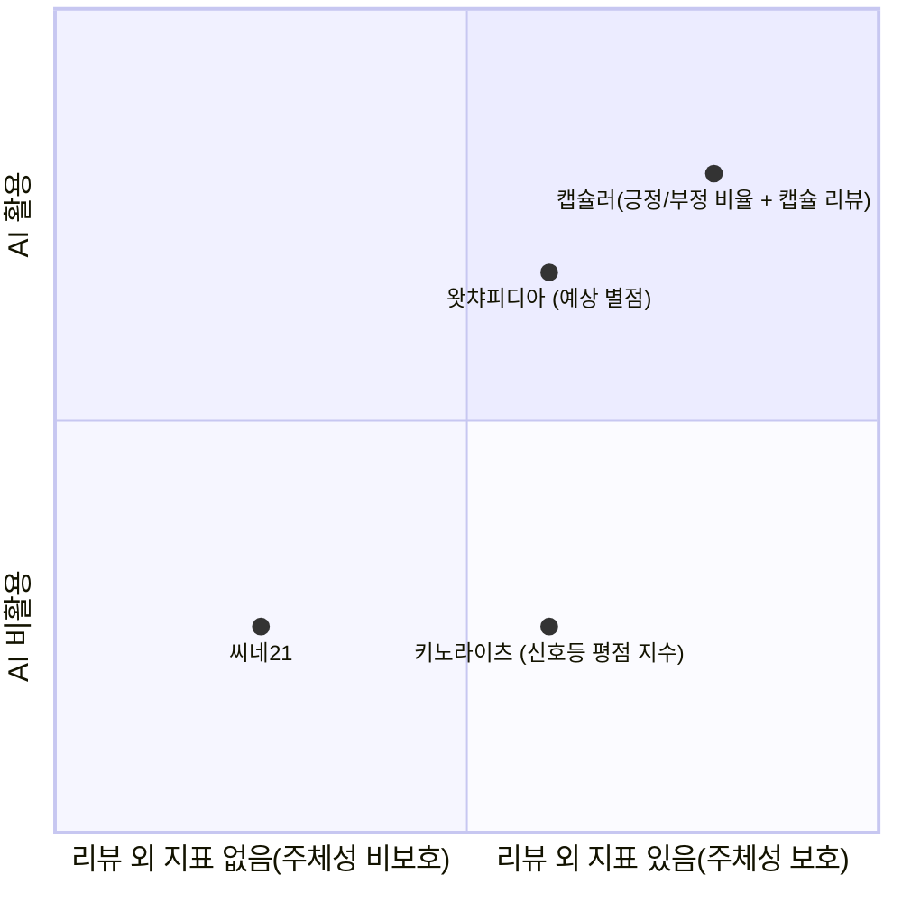
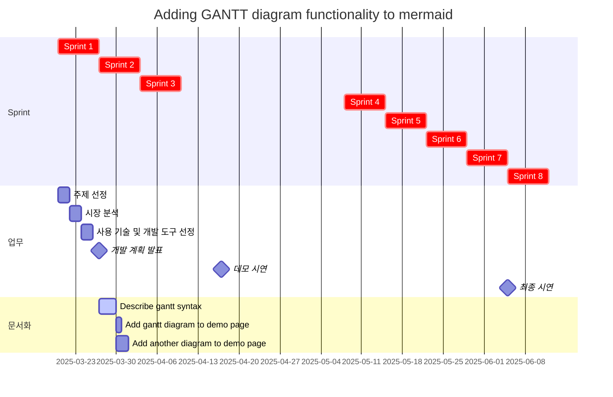

## 소개
### 캐치프레이즈
- *`__=this.catchphrase`*

### 주제
- *`__=this.topic`*

### 주요 기능
- 최신 영화 리스트 제공
- 영화별 긍정/부정 비율 확인 가능
- 스포일러 필터링을 영화의 각 평가 지표에 대해 개별적으로 적용 가능

## 배경 및 필요성
### 배경
- 영화란 종합 예술​
- 다양한 요소로 구성되며, 여러 측면에서 평가될 수 있음

##### 1. 기술적 측면:
- **촬영(시네마토그래피)**: 카메라 워크, 조명, 색감, 구도
- **편집**: 장면 전환, 컷 구성, 리듬감
- **음향**: 사운드 디자인, 배경음악(BGM), 효과음
- **특수효과(VFX)**: CGI, 실감 나는 액션·판타지 연출
- **프로덕션 디자인**: 세트, 소품, 의상
    
##### 2. 시나리오(스토리 및 각본):
- **줄거리(구성력)**: 전개 방식, 기승전결
- **대사**: 대사의 자연스러움, 감정 전달력
- **캐릭터 구축**: 개성과 심리적 깊이
- **주제의식**: 영화가 전달하는 메시지
    
#####  3. 연기 및 캐릭터 표현
- **배우의 연기력**: 감정 표현, 대사 전달
- **배우 간 케미스트리**: 연기 호흡, 시너지
- **배역과의 적합성**: 캐스팅의 적절성

##### 4. 연출(감독의 역량)
- **장르 해석**: 장르적 특징을 얼마나 잘 살렸는가
- **미장센**: 화면 속 요소 배치, 분위기 조성
- **감독의 스타일**: 영화만의 독창성, 차별점
    
##### 5. 감상 및 몰입도
- **재미(오락성)**: 흥미로운가? 지루하지 않은가?
- **감정 전달**: 감동, 긴장감, 공포 등 정서적 반응
- **메시지 전달력**: 의미 있는 메시지를 효과적으로 전달했는가

##### 6. 기타 요소
- **OST**: 음악의 활용과 감정적 효과
- **흥행성(대중성 vs 예술성)**: 상업성과 작품성의 균형
- **사회적 영향력**: 시대적 반영, 문화적 의미

- 이렇게 다양한 요소가 있지만 대부분의 서비스에서 스포일러 필터링을 오직 시나리오, 그 중에서도 줄거리가 포함된 리뷰에만 편향적으로 적용하고 있음

### 필요성
- 주체적인 영화 감상을 위해서는 모든 측면의 스포일러를 방지해야 함

### 해결 방안
> [!TIP] 주요 기능이 새로운 시선으로 보이는 지점

- 리뷰를 캡슐화함
- 기본적으로 모든 리뷰 내용을 감추고 긍정/부정의 비율만 보여줌
- 서비스 이용자가 선택한 측면에 해당하는 스포일러만 허용

## 개발 목표
- KoBERT 기반 다중 레이블 분류 모델을 통해, 선택적 스포일러 필터링이 가능하며 영화별 긍정/부정 평가 비율까지 제공하는 웹 서비스 구축

## 기대 효과
- 사전 정보를 차단하여 주체적인 영화 감상 가능

## 시장 분석
### 유사 서비스와의 차별성 (포지셔닝)

## 앱 설계
### 사용자 시나리오
### 화면 구성도
### 정보구조설계 - 메뉴트리
### 플로우차트

### 와이어프레임
### 프로토타입

## 개발 상세 내용
### 아키텍처 구조

### 디렉토리 구조

### 사용 기술 및 개발 도구
#### 사용 기술
- 도커
✅ KoBERT 기반 다중 레이블 분류 모델을 사용
✅ 각 측면(스토리, 연기, 연출, 음악)에 대해 0/1 라벨링
✅ BCEWithLogitsLoss 활용해 다중 레이블 예측
✅ Sigmoid 활성화를 이용하여 0.5 이상이면 긍정으로 판단

#### 사용 언어
| 언어     | 버전     |
| ------ | ------ |
| Python | 3.13.2 |

#### 사용 IDE
| 언어     | 버전  |
| ------ | --- |
| VSCode |     |

#### 사용 서버
| 서버        | 버전     |
| --------- | ------ |
| Streamlit | 1.43.2 |

#### 사용 AI 모델
| 모델     | 버전    |
| ------ | ----- |
| KoBERT | 0.2.3 |

#### 사용 말뭉치 데이터
| 모델                           | 버전  | 출처                          |
| ---------------------------- | --- | --------------------------- |
| Naver sentiment movie corpus | 1.0 | https://github.com/e9t/nsmc |

#### 사용 라이브러리
| 언어     | 라이브러리             | 버전     | 컴포넌트/모듈|클래스                            | 용도                  |
| ------ | ----------------- | ------ | -----------------------------|-------- | ------------------- |
|  Python      | Streamlit         | 1.43.2 |                                       ||    서버 +  데이터 시각화          |
|         | Scrapy-playwright | 0.0.43 |  scrapy                      || 정적 데이터 크롤링 |
|            |      |                 |scrapy_playwright.page        |PageMethod| 왓챠피디아 리뷰 동적 데이터 크롤링 |
|        | Pandas            | 2.2.3  | pandas                                || 데이터 불러오기            |
|        | Scikit-learn      | 1.6.1  | sklearn.model_selection |train_test_split|      |
|        | Transformers        | 4.50.0|                                       ||                     |
|        |||                                       |BertModel|                     |
|        | PyTorch        | 2.6.0 |    torch                                   ||      NumPy와 같은 Tensor 라이브러리, 강력한 GPU 지원               |
|        |       | |    torch.optim                          ||    최적화(optimizer) 알고리즘을 포함하는 모듈                 |
|        |       | |torch.nn  ||           최대의 유연성을 위해 설계된 자동 그래디언트와 긴밀하게 통합된 신경망 라이브러리          |
|        |       | |    torch.utils.data                                   |Dataset|         편의성을 위한 DataLoader 및 기타 유틸리티 기능            |
|        |       | |    torch.utils.data                                   |DataLoader|         편의성을 위한 DataLoader 및 기타 유틸리티 기능            |

#### 사용 외부 리소스/API
| 외부 리소스    | URI                      | API |
| --------- | ------------------------ | --- |
| 왓챠피디아 코멘트 | https://pedia.watcha.com | 크롤링 |

## 애자일 프로젝트 추진 일정

<table>
  <tr>
    <td>스프린트 1</td>
    <td>3/20 ~ 3/26</td>
    <td>주제 선정</td>
    <td>기능명세서 작성</td>
    <td>프로그래밍 언어/IDE/라이브러리/인공지능 모델/API/DBMS/서버 선정</td>
    <td>화면 설계/플로우 차트</td>
    <td>개발 계획서 작성</td>
  </tr>
  <tr>
    <td></td>
    <td>3/27</td>
    <td>개발 계획 발표</td>
  </tr>
  <tr>
    <td>스프린트 2</td>
    <td>4/3 ~ 4/9</td>
    <td>프로젝트 환경구축 및 데이터 정리</td>
  </tr>
  <tr>
    <td>스프린트 3</td>
    <td>4/10 ~ 4/16</td>
    <td>MVP 기능 구현</td>
    <td>데이터 로드 및 전처리</td>
    <td>모델 학습</td>
    <td>모델 평가</td>
  </tr>
  <tr>
    <td></td>
    <td>4/17</td>
    <td>데모 시연</td>
  </tr>
  <tr>
    <td>스프린트 4</td>
    <td>5/8 ~ 5/14</td>
    <td>감정 판별 기능 구현</td>
  </tr>
  <tr>
    <td>스프린트 5</td>
    <td>5/15 ~ 5/21</td>
    <td>화면 구현</td>
  </tr>
  <tr>
    <td>스프린트 6</td>
    <td>5/22 ~ 5/28</td>
    <td>화면과 인공지능 기능 연동</td>
  </tr>
  <tr>
    <td>스프린트 7</td>
    <td>5/29 ~ 6/4</td>
    <td>화면과 인공지능 기능 연동</td>
  </tr>
  <tr>
    <td></td>
    <td>6/5</td>
    <td>최종 시연</td>
  </tr>
  <tr>
    <td>스프린트 8</td>
    <td>6/6 ~ 6/27</td>
    <td>보고서 작성</td>
  </tr>
  <tr>
    <td></td>
    <td>6/28</td>
    <td>보고서 제출</td>
  </tr>
</table>

## 기대 효과
